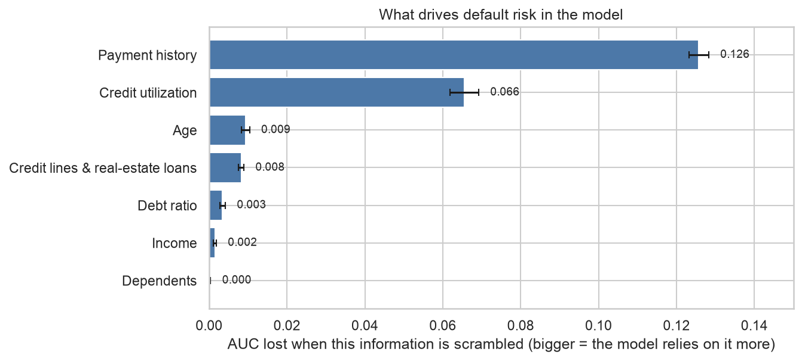
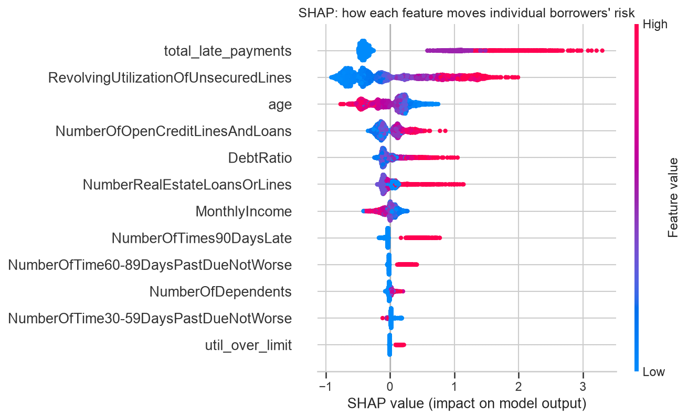
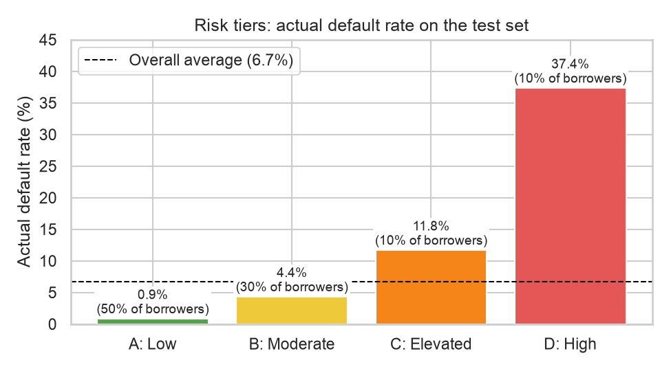

# Credit Risk & Loan Default Prediction

**Can a model spot which borrowers are likely to fall seriously behind on their payments, and what does it get right and wrong?**

I built and tested a machine learning model on 150,000 consumer borrowers from a public dataset, kept 30,000 of them locked away until the final test, and translated the results into findings a bank manager could act on.

**Motivation.** As a Consumer Account Manager at Postal Savings Bank of China, I personally conducted 320+ pre-loan credit investigations, spending a year judging by hand whether a borrower would repay. This project asks whether a model can learn that same judgment from data, and where it would still fall short.

> **Scope note.** The data is the public [Give Me Some Credit](https://www.kaggle.com/c/GiveMeSomeCredit) dataset from a Kaggle competition. Its country and lender are unknown, so it does not represent any particular bank's customers. There are no underwriters' decisions in it either, so the "benchmark" below is against simple rules of thumb, not against real underwriters.

---

## Headline results

Everything below is measured on **30,000 borrowers the model never saw during training or tuning**.

| | Result |
|---|---|
| **Ranking quality (AUC)** | **0.869** (95% confidence interval 0.861 to 0.878) |
| Coin flip | 0.500 |
| Model using only income and age | 0.654 |
| Simple rule: rank by number of late payments | 0.780 |
| Riskiest 10% of borrowers | defaulted **37.4%** of the time (5.6x the 6.7% average) and contain **56%** of all defaulters |
| Safest 50% of borrowers | defaulted **0.9%** of the time |
| Versus hand rules (same number of borrowers flagged) | catches **73%** of defaulters vs. 68% for "flag anyone ever late", and 84% vs. 81% for "late or over 75% credit use" |

*AUC is the chance that a randomly chosen defaulter is ranked as riskier than a randomly chosen non-defaulter. 0.5 is a coin flip, 1.0 is perfect.*

## What drives default risk



Two things dominate, and everything else is a distant third:

1. **Payment history.** Borrowers late at least once in two years defaulted 22.2% of the time, versus 2.7% for those never late (about **8 times** as likely).
2. **Credit utilization.** Borrowers using over 75% of their credit limit defaulted 20.5% of the time, versus 2.1% for those using under 25% (about **9.5 times** as likely).

Age, the number of credit lines and the debt ratio form a smaller second tier. Income and number of dependents add little once the others are known. The two main factors **compound**: a borrower never late and using under 25% of credit defaulted 1.2% of the time; one late twice or more and using over 75% defaulted **45.3%** of the time.

**Direction of each effect (SHAP).** Each dot below is one borrower. Red means a high value of that feature, and dots to the right mean the feature pushed that borrower's predicted risk *up*. Many late payments and high utilization push risk up; older age and higher income push it down.



## How a bank could use this

Sorting borrowers into four risk tiers (cut-offs set using training data only), the test-set results were:



| Tier | Share of borrowers | Actual default rate | Share of all defaulters |
|---|---|---|---|
| A: Low | 50% | 0.9% | 7% |
| B: Moderate | 30% | 4.4% | 20% |
| C: Elevated | 10% | 11.8% | 18% |
| D: High | 10% | 37.4% | 56% |

Proposals a bank could test (these are ideas, not measured results): price and set limits by tier; add extra verification for Tier D or when income is missing; review existing customers who have a clean record but use over 75% of their credit (about 8% of them default); prioritize collections on the highest-risk accounts.

## Where the model falls short

- **It misses defaults that come without warning.** At the chosen cut-off it caught 59% of defaulters. The 41% it missed look like ordinary borrowers (only 27% had ever been late), so nothing in these ten columns warns of them.
- **Fairness.** Younger borrowers are flagged far more often (20% of 18-29-year-olds vs. 3% of those 70+), and repaying young borrowers are wrongly flagged about 7 times as often as repaying older ones. Younger borrowers do default more, but the false-flag gap is somewhat larger than the default-rate gap. Removing age from the model barely changes this, because other variables carry the same information. In real lending this would need legal and compliance review.
- **Only approved borrowers are in the data**, so we cannot know how rejected applicants would have behaved.
- **The cut-off depends on an assumed cost ratio** (a missed default costing 5 times a wrongly flagged good borrower). That is an illustration, not a fact from the data.
- **Scores are not probabilities**, and the results describe association, not cause: high utilization may be a symptom of financial stress rather than its cause.

## How it was built

Each step is a notebook written to be read top to bottom, with plain-English explanations.

| Step | Notebook | What it does |
|---|---|---|
| 1. Data cleaning | [01_data_cleaning](notebooks/01_data_cleaning.ipynb) | Finds and fixes problems: 20% missing income, special 96/98 codes in late-payment counts, and a debt-ratio column that holds dollar amounts instead of ratios where income is missing |
| 2. Exploration | [02_eda](notebooks/02_eda.ipynb) | Default rates by age, income, utilization and payment history |
| 3. Features and split | [03_feature_engineering](notebooks/03_feature_engineering.ipynb) | 80/20 stratified split; cleaning re-learned from training data only to avoid leakage; three new features |
| 4. Modeling | [04_modeling](notebooks/04_modeling.ipynb) | Logistic regression, random forest and gradient boosting, compared by cross-validation; class imbalance handling |
| 5. Evaluation | [05_evaluation](notebooks/05_evaluation.ipynb) | One-time scoring on the test set, confidence intervals, cut-off choice, feature importance (permutation and SHAP), error analysis |
| 6. Business interpretation | [06_business_interpretation](notebooks/06_business_interpretation.ipynb) | Plain-language findings, risk tiers, fairness by age, limitations |

Reusable cleaning and feature code is in [`src/preprocessing.py`](src/preprocessing.py).

**Choices worth knowing about**
- The model is scikit-learn's gradient boosting, tuned lightly. It beats logistic regression by only 0.005 AUC on the test set, so a simple, fully readable logistic regression (AUC 0.864) is a serious alternative.
- Class imbalance (only 6.7% default) is handled with class weights. SMOTE (synthetic defaulters) was tested and gave no gain.
- The test set was never used to train, tune or choose the model. The approve/reject cut-off was chosen from training data before looking at test results.

## How to run it

**1. Get the data** (not included in this repo): follow [`data/README.md`](data/README.md) to download `cs-training.csv` from Kaggle into `data/`. You must join the competition to download; no submission is needed.

**2. Set up Python** (3.11 or newer; tested with 3.13):

```bash
python3 -m venv .venv
source .venv/bin/activate
pip install -r requirements.txt
```

**3. Run the notebooks in order** (1 to 6). Notebook 4 takes a few minutes because it tunes the models. To run them all from the command line:

```bash
cd notebooks
for n in 01_data_cleaning 02_eda 03_feature_engineering 04_modeling 05_evaluation 06_business_interpretation; do
  jupyter nbconvert --to notebook --execute --inplace $n.ipynb
done
```

Random seeds are fixed, so results should reproduce.

## Repository layout

```
credit-risk-default-prediction/
├── README.md
├── requirements.txt
├── data/          # data instructions (raw and processed CSVs are not committed)
├── notebooks/     # the six analysis notebooks, in order
├── src/           # reusable cleaning and feature-engineering code
├── reports/       # charts used in the notebooks and this README
└── models/        # saved models are created here when notebook 4 runs (not committed)
```

## Credits

Data: [Give Me Some Credit](https://www.kaggle.com/c/GiveMeSomeCredit), Kaggle. Built with pandas, scikit-learn, imbalanced-learn, SHAP, matplotlib and seaborn.
